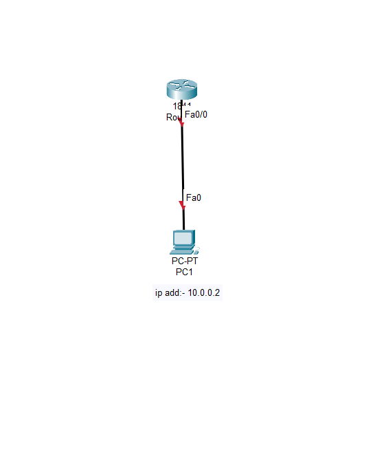

Basic Router Configuration (1 Router + 1 PC)

🔹 Step 1: Devices Required
1 Router
1 PC
1 Copper Straight-Through Cable

Step 2: Connections
Connect PC0 → FastEthernet0
Connect Router0 → FastEthernet0

      
